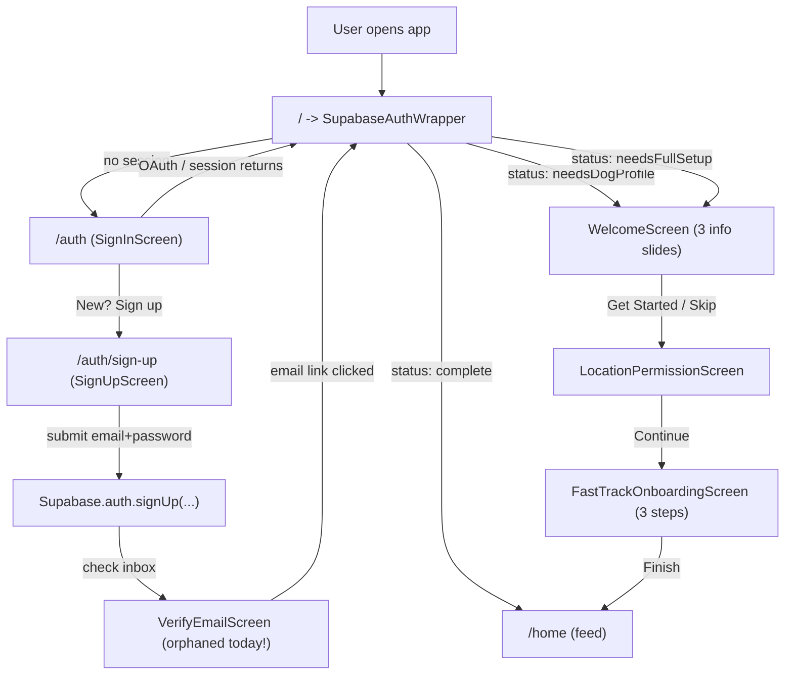

# Onboarding & Auth Journey Map

_A complete map of what happens from the moment a user opens BarkDate through to their first feed screen. Every button, every persisted field, every side effect. Use this as the source of truth when we change onboarding._

Last verified: 2026-04-19.

---

## 1. The big picture



Everything below drills into one box at a time.

---

## 2. Startup & router

### `lib/main.dart`

Calls `WidgetsFlutterBinding.ensureInitialized`, then:

1. `SupabaseConfig.initialize()` - reads env, boots the Supabase client.
2. `SettingsService().initialize()` - loads user prefs from `SharedPreferences`.
3. `NotificationManager.initialize()` - Firebase Messaging init.
4. `ReminderDispatchService().start()` - background reminder poller.
5. `runApp(ProviderScope(child: BarkDateApp()))`.

### `lib/app.dart`

Sets up the GoRouter, theme, and one global listener:

```dart
SupabaseConfig.auth.onAuthStateChange.listen((data) async {
  if (data.event == AuthChangeEvent.signedIn && ...) {
    // warm caches for the signed-in user
  }
});
```

### Router entry

File: `lib/core/router/app_routes.dart` (L38-L44)

```dart
@TypedGoRoute<SplashRoute>(path: '/')
class SplashRoute extends GoRouteData with $SplashRoute {
  const SplashRoute();
  @override
  Widget build(BuildContext context, GoRouterState state) =>
      const SupabaseAuthWrapper();
}
```

Every "where should I go next?" in the app eventually hits `SplashRoute().go(context)`, which re-runs the wrapper's decision.

### `SupabaseAuthWrapper` (the brain of the flow)

File: `lib/widgets/supabase_auth_wrapper.dart`

- Listens to `Supabase.instance.client.auth.onAuthStateChange`.
- **No session** -> renders `SignInScreen`.
- **Session exists** -> calls `_fetchProfileStatus(userId)`:
  1. `SELECT id, name, bio, avatar_url FROM users WHERE id = :userId`.
  2. If no row or `name` is empty -> `ProfileStatus.needsFullSetup`.
  3. Else query `SELECT id FROM dogs WHERE user_id = :userId LIMIT 1`. If no dog row -> `ProfileStatus.needsDogProfile`. Else -> `ProfileStatus.complete`.
- Maps status to a screen:
  - `complete` -> warm feed caches via `PreloadService`, then `HomeRoute().go(context)`.
  - `needsDogProfile` -> `WelcomeScreen`.
  - `needsFullSetup` -> `WelcomeScreen` (same screen today; they're both the onboarding entry point).

There are only three branches. No sub-states for "has a name but not avatar", etc. "Where am I in onboarding?" is implicit in each onboarding screen pushing the next one.

---

## 3. Sign up (email + password)

File: `lib/features/auth/presentation/screens/sign_up_screen.dart`

Route: `/auth/sign-up` (via `TypedGoRoute<SignUpRoute>`). Pushed from the SignIn screen's "Sign Up" link.

### Fields collected

| UI field | Local var | Required? |
| --- | --- | --- |
| Full Name | `_nameController` | yes (>= 2 chars) |
| Email | `_emailController` | yes (`Validators.validateEmail`) |
| Password | `_passwordController` | yes (>= 6 chars) |
| Confirm Password | `_confirmPasswordController` | yes (must match) |
| Accept Terms | `_acceptTerms` | yes (checkbox) |

### Buttons

- **Sign Up** (email form) -> `_signUp()`:
  - Validates form, then:

    ```dart
    await ref.read(authRepositoryProvider).signUp(
      email: email,
      password: password,
      data: {'name': _nameController.text.trim()},
    );
    ```

    which calls `_auth.signUp(email, password, data)` in `lib/features/auth/data/repositories/auth_repository_impl.dart`.
  - **Today**: on success it shows a "Check your email" snackbar and calls `const AuthRoute().go(context)` - i.e. goes **back to the sign-in screen**.
  - **Missing**: does NOT pass `emailRedirectTo`, so Supabase uses the default **Site URL** from the dashboard. Does NOT navigate to a verify screen.

- **Sign up with Google** -> `_signUpWithGoogle()`:
  - `Supabase.auth.signInWithOAuth(OAuthProvider.google, redirectTo: ...)`.
  - On web this redirects off to Google. When it comes back, `SupabaseAuthWrapper` gets an `AuthChangeEvent.signedIn` and picks the right branch.

- **Sign up with Apple** (iOS only) -> `_signUpWithApple()`:
  - Uses `SignInWithApple.getAppleIDCredential` + `Supabase.auth.signInWithIdToken`.
  - On success it warms caches then `SplashRoute().go(context)` -> re-runs the wrapper.

- **Sign In** link at bottom -> `context.pop()`.

### What's persisted by "Sign Up"

1. A row in `auth.users` (Supabase's internal auth table) with the email and hashed password.
2. A row in `public.users` gets created because of a DB trigger / function (`sync_firebase_user_safe` / `handle_new_user` style function in `supabase/migrations/20250910152132_fix_users_foreign_key_constraint.sql`). The trigger pulls the `name` from `raw_user_meta_data` so when we did `signUp(data: {'name': ...})`, `public.users.name` gets populated.
3. Supabase sends a verification email to the user's inbox using the **Confirm signup** email template.

Until the user verifies, `auth.users.email_confirmed_at` is `NULL`. Depending on the dashboard **Auth > Email** settings, the user may or may not be allowed to sign in without verifying.

---

## 4. Email verification (the broken link we're fixing in Sprint 2)

### The email itself

Supabase sends a link like:

```
https://<your-site-url>/?type=signup&access_token=...
```

The `<your-site-url>` comes from **Authentication > URL Configuration > Site URL** in the Supabase dashboard.

For the link to be allowed to open, the exact URL scheme/host must also be on the **Redirect URLs** allowlist.

### What happens when the user clicks the link

- **On web**: browser opens `<site-url>/?...`. If that's your deployed web build URL, Supabase-flutter-web picks up the params and fires `AuthChangeEvent.signedIn`. `SupabaseAuthWrapper` reruns. Since `public.users.name` is populated (from step 3 above) but no dog yet, status is usually `needsDogProfile` -> `WelcomeScreen`.
- **On native**: nothing is set up today. The app uses no deep-link scheme (no `io.supabase.bark://login-callback/` handler wired into the signup flow). So the link opens in Safari/Chrome and stops there.

### `VerifyEmailScreen` (currently orphaned)

File: `lib/screens/auth/verify_email_screen.dart`

- No one imports it; no route points at it. It exists but is unreachable.
- Its "I've verified" button:
  - Calls `SupabaseConfig.auth.refreshSession()`.
  - If `user.emailConfirmedAt != null`, it pushes to the **legacy** `MainNavigation` (not the router) or to `CreateProfileScreen`. It does NOT route through `SplashRoute` -> `SupabaseAuthWrapper`.

**Net effect today**: after signup, user hits snackbar, goes back to sign-in, and the verify screen is never seen.

---

## 5. Welcome (3 info slides)

File: `lib/screens/onboarding/welcome_screen.dart`

Three marketing slides in a `PageView`:
1. "Find Nearby Dog Friends" (location icon, green).
2. "Schedule Playdates" (calendar icon, blue).
3. "Build Your Pack" (groups icon, orange).

### Buttons

- **Back arrow** (top left) -> `AuthRoute().go(context)`.
- **Skip** (top right) -> `_navigateToNext()`.
- **Next** (on slides 1 and 2) -> `_pageController.nextPage(...)`.
- **Get Started** (only visible on slide 3) -> `_navigateToNext()`.

`_navigateToNext()` pushes `LocationPermissionScreen` via `Navigator.pushReplacement` (not GoRouter).

Nothing is persisted here.

---

## 6. LocationPermissionScreen (the permissions tile screen)

File: `lib/screens/onboarding/location_permission_screen.dart`

Title: "Set Up Permissions". Subtitle: "Enable these for the best experience".

Two tappable tiles and one "Continue" button.

### Tile 1 - Location (`_requestLocationPermission`)

1. `LocationService.requestPermission()` -> calls `Geolocator.requestPermission()`. This shows the **OS permission dialog**. Returns `true` if granted.
2. If granted, `LocationService.syncLocation(userId)` -> calls `Geolocator.getCurrentPosition(...)` then:

    ```dart
    UPDATE users
    SET latitude=?, longitude=?, location_updated_at=?
    WHERE id=?;
    UPDATE dogs
    SET latitude=?, longitude=?
    WHERE user_id=?;
    ```

3. `setState(() => _locationEnabled = synced)` and shows a "Location enabled!" snackbar.

What is NOT done here:
- Does not flip `SettingsService.setLocationEnabled(true)` in SharedPreferences. So the Settings screen's "Location Sharing" toggle can still read `true` (default) or `false` (user previously flipped it), totally decoupled.

### Tile 2 - Notifications (`_requestNotificationPermission`)

1. `FirebaseMessaging.instance.requestPermission(alert: true, badge: true, sound: true)` -> shows the **OS notification dialog**.
2. If granted, `messaging.getToken()` -> updates `users.fcm_token`:

    ```dart
    UPDATE users SET fcm_token=? WHERE id=?;
    ```

3. `setState(() => _notificationsEnabled = granted)` and shows a snackbar.

What is NOT done here:
- Does not flip `SettingsService.setNotificationsEnabled(true)`. Same disconnect.

### "Continue" button (`_enableAllPermissions`)

Runs both requests sequentially, then `_navigateNext()`:

- Pushes `FastTrackOnboardingScreen(userId, userName)` via `Navigator.pushReplacement`.

---

## 7. FastTrackOnboardingScreen (the actual dog profile setup)

File: `lib/screens/onboarding/fast_track_onboarding_screen.dart`

A 3-step `PageView`. Back arrow / system back goes to the previous step until step 0, where it exits.

### Step 1 - dog name

- `TextField` for dog's name.
- **Next** enabled when non-empty. Calls `_goToStep(1)`.

### Step 2 - dog breed

- Autocomplete backed by `DogBreedService.searchBreeds`.
- **Next** enabled when non-empty. Calls `_goToStep(2)`.

### Step 3 - photo + size + gender

- Circular photo picker (required for Finish).
- Size: `Small` / `Medium` / `Large` segmented buttons (default `Medium`).
- Gender: `Boy` / `Girl` segmented buttons (default `Male`).
- **Finish** -> `_finishOnboarding()`:

    1. Uploads photo to `dog-photos` storage bucket.
    2. Calls `BarkDateUserService.addDog(userId, {...})` with:

        ```dart
        {
          'name': _dogNameController.text.trim(),
          'breed': _dogBreedController.text.trim(),
          'age': 1,            // hardcoded
          'size': _dogSize,    // Medium by default
          'gender': _dogGender,
          'bio': '',
          'main_photo_url': photoUrl,
          'extra_photo_urls': <String>[],
          'photo_urls': photoUrl != null ? [photoUrl] : <String>[],
          'is_public': true,
        }
        ```

    3. `SupabaseAuthWrapper.clearProfileCache(userId)` (so the wrapper will re-fetch `ProfileStatus`).
    4. `HomeRoute().go(context)` - lands on the feed.

---

## 8. Field -> column cheat sheet

### Owner (`public.users` table)

| Field | First set by | Editable at | Supabase column |
| --- | --- | --- | --- |
| name | SignUp form -> `signUp(data: {name})` -> trigger | ProfileScreen owner row -> Human edit page | `users.name` |
| email | Supabase auth user | Read-only in app | `users.email` (mirrored from `auth.users.email`) |
| avatar_url | Owner edit page (optional) | Human edit page | `users.avatar_url` |
| bio | Owner edit page (optional) | Human edit page | `users.bio` |
| location (text) | Owner edit page | Human edit page | `users.location` |
| latitude / longitude | LocationPermissionScreen OR Owner edit page's map picker | Settings + map picker | `users.latitude`, `users.longitude` |
| location_updated_at | Auto with lat/lng | Auto | `users.location_updated_at` |
| relationship_status | Owner edit page | Human edit page | `users.relationship_status` |
| fcm_token | LocationPermissionScreen OR `FirebaseMessagingService` | Auto on token rotate | `users.fcm_token` |
| search_radius_km | Schema default | (no UI yet) | `users.search_radius_km` |
| live_latitude/longitude/privacy | Map tab's live location toggle | Map tab | `users.live_*` |

### Dog (`public.dogs` table)

| Field | First set by | Editable at | Supabase column |
| --- | --- | --- | --- |
| name, breed, age, size, gender | FastTrackOnboardingScreen OR DogDetailsScreen.newDog | DogDetailsScreen edit mode | same names |
| bio | Optional in edit mode | DogDetailsScreen edit mode | `dogs.bio` |
| main_photo_url / extra_photo_urls / photo_urls | FastTrack (main only) OR DogDetails 3-slot editor | DogDetails 3-slot editor | same |
| is_public | Defaulted true | (no UI yet) | `dogs.is_public` |
| latitude / longitude | Mirrored from owner location sync | Owner location updates | `dogs.latitude`, `dogs.longitude` |

### Local-only (`SharedPreferences`, not Supabase)

| Pref | Default | Set by | Read by |
| --- | --- | --- | --- |
| `theme_mode` | system | Settings screen | Theme root |
| `notifications_enabled` | true | Settings screen (only) | Settings screen (only) |
| `location_enabled` | true | Settings screen (only) | Settings screen (only) |
| `privacy_mode` | false | Settings screen (only) | Settings screen (only) |

`SettingsService` (`lib/services/settings_service.dart`) is the owner of these. See the Disconnect below.

---

## 9. Known disconnects (what Sprint 2 and Sprint 3 fix)

### Disconnect A - Email verify never lands on onboarding

- `SignUpScreen._signUp()` does not push a verify screen; it just goes back to sign-in.
- `VerifyEmailScreen` exists but is unreachable (no import, no route).
- `emailRedirectTo` is not passed to `signUp`, so native deep links can't land back in the app even if configured.
- Result: users on email signup must manually log back in after clicking the verification link.

**Sprint 2 fixes all three**: add a route for the verify screen, push it from signup, route "I've verified" through `SplashRoute` so the wrapper picks the right next screen, pass `emailRedirectTo`, and change the `needsFullSetup` branch to open the LocationPermissionScreen directly (instead of the 3-slide Welcome) for freshly verified users.

### Disconnect B - Permissions and Settings don't talk to each other

- Onboarding permission screen writes to the OS + `users.fcm_token` / `users.latitude` / `users.longitude`.
- Settings toggles write to `SharedPreferences` only, nothing else.
- There is no two-way sync. A user can have:
  - OS permission granted + Settings toggle off -> app thinks they're opted out.
  - OS permission denied + Settings toggle on -> app thinks they're opted in but physically can't do anything.

**Sprint 3 fixes** by:
1. Onboarding calls `SettingsService.setLocationEnabled(bool)` / `setNotificationsEnabled(bool)` reflecting what actually happened (granted or denied).
2. `SettingsService` setters propagate effects: `setLocationEnabled(false)` calls `LocationService.disableLocation(userId)` (nulls lat/lng). `setNotificationsEnabled(false)` clears `users.fcm_token`.

### Disconnect C - The 3-slide Welcome is shown to everyone, including freshly verified users

Arguably fine as a first-run, but today it also shows on every re-open if the user hasn't added a dog yet (because `needsDogProfile` routes there). The Sprint 2d change will keep Welcome for that edge case but skip it right after email verification, landing users on permissions first.

---

## 10. Glossary

- **Session**: Supabase's active auth token. Created on sign-in, destroyed on sign-out.
- **`auth.users`**: Supabase-managed auth table (email + hashed password + verification timestamp). You don't edit this directly.
- **`public.users`**: our profile table; 1-to-1 with `auth.users`, created by a DB trigger. Our app reads and writes this.
- **Site URL**: the "home address" for all auth redirect emails. Dashboard setting.
- **Redirect URLs**: allowlist of addresses emails/OAuth are allowed to return to. Dashboard setting.
- **`emailRedirectTo`**: per-call override when doing `signUp`. Must be on the Redirect URLs allowlist.
- **`onAuthStateChange`**: Supabase's stream of `signedIn / signedOut / tokenRefreshed / ...` events; the wrapper listens to this.
- **`SplashRoute`**: the `/` route that renders `SupabaseAuthWrapper`. Use `.go(context)` after any auth state change to re-pick the right screen.
