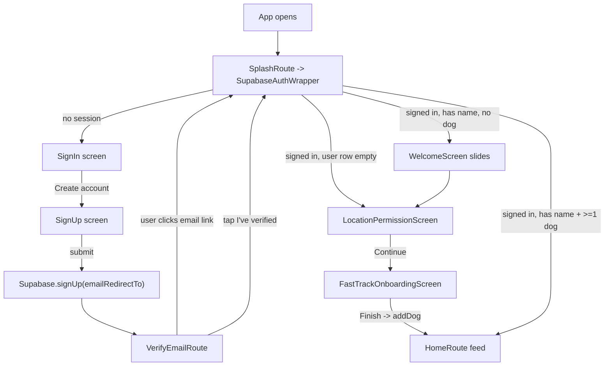

## Sprints and check gates (at a glance)

| Sprint | What ships | Check gate before next |
| --- | --- | --- |
| 1a | `docs/onboarding_flow_map.md` | You read it, tell me if anything is wrong |
| 1b | `docs/supabase_auth_setup.md` (Dashboard-first, SQL, CLI appendix) | You can follow it without me |
| 2a | `VerifyEmailRoute` added to router | `flutter analyze` clean |
| 2b | SignUp pushes verify screen | Manual: signup -> lands on Verify screen |
| 2c | Verify screen "I've verified" goes via `SplashRoute` | Manual: tap button -> lands on onboarding or home |
| 2d | `needsFullSetup` -> LocationPermissionScreen | Manual: new verified user -> Location screen, no 3-slide welcome |
| 2e | `emailRedirectTo` on signUp | Manual: real email link opens the app/web build |
| 3a | Onboarding writes to SettingsService | Deny mic location during onboarding, open Settings -> toggle is off |
| 3b | SettingsService writes to DB/OS | Toggle Push in Settings off -> `users.fcm_token` becomes NULL |

Each sprint's code change is small enough that if something regresses, you can revert just that sprint.

## Why the Supabase setup is part-clicking, part-SQL (plain language)

Supabase is two rooms under one roof:

1. **Database room** (tables, functions, triggers). You control this with SQL. I can give you SQL to paste into Dashboard > Database > SQL Editor.
2. **Auth room** (login, email verification, OAuth, session rules). This lives in a separate service (`gotrue`). Its knobs are NOT exposed as SQL tables. You set them either by clicking Dashboard > Authentication pages, or via the Supabase CLI / Management API.

So the setup doc has three parts:
- **Part A - Dashboard click-through** for the auth knobs (Site URL, Redirect URLs, optionally email templates). Screenshots-style bullets, no SQL.
- **Part B - SQL to paste** for the optional `handle_new_user` trigger that fills `users.name` from the signup metadata. Safe to re-run.
- **Part C - CLI appendix** for whenever your CLI wakes up: the equivalent `supabase ...` commands.

No SQL alone will set the Site URL. No CLI alone will set the handle_new_user trigger (well, it can via `supabase db push`, but the SQL is the source anyway). They're meant to be used together.

## What exists today (the honest map)

### Startup + router
- [lib/main.dart](lib/main.dart) -> [lib/app.dart](lib/app.dart) boots Supabase/Firebase/SettingsService/NotificationManager, then runs `BarkDateApp`.
- Router entry is `@TypedGoRoute<SplashRoute>(path: '/')` in [lib/core/router/app_routes.dart](lib/core/router/app_routes.dart#L38) -> renders `SupabaseAuthWrapper`.
- [lib/widgets/supabase_auth_wrapper.dart](lib/widgets/supabase_auth_wrapper.dart) listens to `onAuthStateChange`, reads the `users` row, and picks one of three branches:
  - `ProfileStatus.complete` (has `name` AND >=1 dog) -> warm caches -> `HomeRoute`.
  - `ProfileStatus.needsDogProfile` (has name, no dogs) -> `WelcomeScreen`.
  - `ProfileStatus.needsFullSetup` (no user row or no name) -> `WelcomeScreen`.
- The `ProfileStatus` only has three states; it does NOT know about onboarding sub-steps. Which screen actually shows is decided by each onboarding screen pushing the next one manually via `Navigator.pushReplacement(...)`.

### Email sign-up + verification path today
- `_signUp()` in [lib/features/auth/presentation/screens/sign_up_screen.dart](lib/features/auth/presentation/screens/sign_up_screen.dart#L151) calls `Supabase.signUp(email, password, data: {name})`.
  - Does NOT pass `emailRedirectTo`, so Supabase uses its default "Site URL".
  - On success it shows a snackbar and navigates **back to sign-in** (`AuthRoute().go(context)`). It never pushes a verify screen.
- The "verify your email" screen exists at [lib/screens/auth/verify_email_screen.dart](lib/screens/auth/verify_email_screen.dart) but is **orphaned**; no one imports it. It also navigates to the legacy `MainNavigation` / `CreateProfileScreen` directly instead of going through the router.
- When the user taps the email link:
  - On **native** it needs a deep link / universal link -> not currently configured (no `emailRedirectTo`, no deep-link intent filter referenced in the auth flow).
  - On **web** Supabase redirects back to the Site URL. If that points at the app URL, the Supabase client fires an `AuthChangeEvent.signedIn`, `SupabaseAuthWrapper` re-runs `_fetchProfileStatus`, user has no `users` row yet (trigger creates it, but with empty `name` unless sign-up passes it) -> `needsFullSetup` -> shows `WelcomeScreen`.
- Net effect: after verifying, user lands on the 3-slide `WelcomeScreen`, has to tap Skip/Get Started, goes to `LocationPermissionScreen`, then `FastTrackOnboardingScreen`. There is no explicit "start onboarding at page 1" after verification.

### The onboarding chain (what each screen does)

1) [lib/screens/onboarding/welcome_screen.dart](lib/screens/onboarding/welcome_screen.dart) - 3 info slides (Find Nearby Dog Friends / Schedule Playdates / Build Your Pack). "Skip" and "Get Started" both call `_navigateToNext()` which pushes `LocationPermissionScreen`.
2) [lib/screens/onboarding/location_permission_screen.dart](lib/screens/onboarding/location_permission_screen.dart) - two permission tiles + a "Continue" (`_enableAllPermissions`) that:
   - Calls `LocationService.requestPermission()` + `LocationService.syncLocation(userId)` -> writes `users.latitude`, `users.longitude`, `users.location_updated_at` and mirrors to `dogs.latitude/longitude` for that owner.
   - Requests FCM permission directly via `FirebaseMessaging.instance.requestPermission(...)`, gets the FCM token and writes `users.fcm_token` if granted.
   - Then `Navigator.pushReplacement` -> `FastTrackOnboardingScreen(userId, userName)`.
   - **Important**: it does NOT call `SettingsService.setNotificationsEnabled(true)` or `SettingsService.setLocationEnabled(true)`. Those two booleans live in `SharedPreferences` and default to `true`. The Settings screen's toggles flip these prefs; they do NOT revoke the OS permission or clear `users.fcm_token`. So permissions + settings are today **two independent switches** (OS/DB vs local prefs).
3) [lib/screens/onboarding/fast_track_onboarding_screen.dart](lib/screens/onboarding/fast_track_onboarding_screen.dart) - 3-step dog setup (name -> breed -> photo/size/gender). On Finish it:
   - Uploads the photo to `dog-photos` storage bucket.
   - Calls `BarkDateUserService.addDog(userId, {...})` -> inserts into `dogs`.
   - Clears the profile-status cache and `HomeRoute().go(context)`.
4) [lib/screens/onboarding/create_profile_screen.dart](lib/screens/onboarding/create_profile_screen.dart) - the full two-step owner+dog form. Currently reachable only via `CreateProfileRoute(editMode: createProfile)` which nothing on the onboarding path actually calls (it's primarily used for the human/dog EDIT flows now).

### What writes to where (so you can reason about "is it persisted?")

- OWNER fields -> `users` table:
  - `name` comes from `signUp.data = {'name': ...}` via a Supabase DB trigger that inserts the initial `users` row (see `supabase/migrations/20250910152132_fix_users_foreign_key_constraint.sql`). After that, `BarkDateUserService.updateUserProfile(userId, {...})` is the only path.
  - `avatar_url`, `bio`, `location`, `relationship_status`, `latitude`, `longitude`, `location_updated_at` -> set from the owner-edit screen via `updateUserProfile`.
  - `fcm_token` -> written by `LocationPermissionScreen` and [lib/services/firebase_messaging_service.dart](lib/services/firebase_messaging_service.dart).
  - `live_latitude`, `live_longitude`, `live_location_privacy`, `live_location_updated_at` -> written by the map tab ([lib/screens/map_v2/map_tab_screen.dart](lib/screens/map_v2/map_tab_screen.dart)) and by the live-tracking migration.
  - `search_radius_km` -> defined in schema, no UI today (column exists, nothing writes to it).
- DOG fields -> `dogs` table:
  - Created by `FastTrackOnboardingScreen` (or "Add Dog" which now uses `DogDetailsScreen.newDog()`), updated by `DogDetailsScreen` edit mode.
- Local-only settings (SharedPreferences):
  - `notifications_enabled`, `location_enabled`, `privacy_mode`, `theme_mode` are in [lib/services/settings_service.dart](lib/services/settings_service.dart). Toggling them in Settings ONLY changes the pref; it doesn't touch `users.fcm_token` or OS permissions.

### Disconnect summary (the two things you asked about)

- **After email verify, user doesn't land on onboarding page 1.** There's no dedicated verify screen in the flow; `SignUpScreen` just goes back to sign-in, and the orphaned `VerifyEmailScreen` goes via the legacy `MainNavigation` path. On verify they eventually reach `WelcomeScreen` only because the auth wrapper fires `needsFullSetup`. We can close this loop properly.
- **Permission screen vs Settings screen disagree.** Location screen writes to `users.fcm_token`, `users.latitude/longitude`, and the OS. Settings toggles only the local SharedPreferences. If you toggle "Push Notifications" off in Settings, FCM still gets delivered and `fcm_token` stays in the DB. They should be in sync.

## Fix 1 - Route to onboarding step 1 after email verify

Changes:

- Wire `SignUpScreen._signUp()` to push the new verify screen instead of going back to sign-in:

```dart
// in _signUp after successful signUp
VerifyEmailRoute(email: _emailController.text.trim()).push(context);
```

- Move the verify screen onto the router. Add `VerifyEmailRoute` in [lib/core/router/app_routes.dart](lib/core/router/app_routes.dart) at top level (peer of `/auth`):

```dart
@TypedGoRoute<VerifyEmailRoute>(path: '/verify-email')
class VerifyEmailRoute extends GoRouteData with $VerifyEmailRoute {
  final String email;
  const VerifyEmailRoute({required this.email});
  @override
  Widget build(BuildContext context, GoRouterState state) =>
      VerifyEmailScreen(email: email);
}
```

- Rewrite the "I've verified" button handler in [lib/screens/auth/verify_email_screen.dart](lib/screens/auth/verify_email_screen.dart) to route through the auth wrapper rather than `MainNavigation`:
  - Call `SupabaseConfig.auth.refreshSession()`.
  - If `user?.emailConfirmedAt != null`, call `SplashRoute().go(context)` and let `SupabaseAuthWrapper` decide where to go based on `ProfileStatus`. That way the rest of the logic stays centralized.
  - Remove the imports of `main_navigation.dart` and `create_profile_screen.dart` from this file.

- Also make the auth listener route to the **onboarding page 1** (not the 3-slide Welcome) when `needsFullSetup` is detected for a freshly-verified user. Tiny branch inside `SupabaseAuthWrapper`:

```dart
case ProfileStatus.needsFullSetup:
  // Skip marketing slides for users who just signed up;
  // go straight to permissions -> fast-track dog setup.
  return const LocationPermissionScreen();
```

(You may still want the 3-slide Welcome for Google/Apple signups that land in `needsDogProfile`. Keep that branch as `WelcomeScreen`; or switch both to `LocationPermissionScreen`. Pick after seeing it.)

- Pass `emailRedirectTo` on `signUp` so the link comes back to the app on both native and web:

```dart
await _auth.signUp(
  email: email,
  password: password,
  data: data,
  emailRedirectTo: kIsWeb
      ? 'https://<your-site-url>/' // web build URL
      : 'io.supabase.bark://login-callback/',
);
```

File: [lib/features/auth/data/repositories/auth_repository_impl.dart](lib/features/auth/data/repositories/auth_repository_impl.dart) (or pass in from the caller if you prefer to keep the repo platform-agnostic).

## Fix 2 - Permission screen <-> Settings screen sync

Make the LocationPermissionScreen write through `SettingsService` AND when the Settings toggles flip, revoke the DB-side effect.

- In [lib/screens/onboarding/location_permission_screen.dart](lib/screens/onboarding/location_permission_screen.dart):
  - After a successful `_requestLocationPermission`, also `SettingsService().setLocationEnabled(true)`.
  - After a successful `_requestNotificationPermission`, also `SettingsService().setNotificationsEnabled(true)`.
  - On denial of either, set the corresponding setting to `false` (so Settings reflects reality instead of showing a default-on toggle for a permission the user denied).

- Extend [lib/services/settings_service.dart](lib/services/settings_service.dart) so the setters also propagate to the real subsystems (keeps Settings as the single source of truth):
  - `setLocationEnabled(false)` -> `LocationService.disableLocation(userId)` (already exists, nulls `users.latitude/longitude` + `dogs.latitude/longitude`).
  - `setLocationEnabled(true)` -> `LocationService.requestPermission()` + `syncLocation(userId)`.
  - `setNotificationsEnabled(false)` -> remove `users.fcm_token` (or just stop writing new ones; simplest: `users.update({'fcm_token': null})`).
  - `setNotificationsEnabled(true)` -> request FCM permission, write new token.
- This makes the onboarding toggles and the Settings toggles agree. The toggles in Settings at [lib/features/settings/presentation/screens/settings_screen.dart](lib/features/settings/presentation/screens/settings_screen.dart) L555 and L613 already call `_settingsService.setNotificationsEnabled(value)` / `setLocationEnabled(value)` - they'll pick up the new behavior for free.

## Supabase dashboard SQL / config you can paste

Since your CLI isn't working, here's everything you'd normally flip via dashboard pages and/or `supabase db` calls. Keep a short doc at `docs/auth_setup.md` (I can create it if you want).

1) Auth -> URL Configuration (Dashboard UI, not SQL):
- **Site URL**: `https://<your-web-build-domain>` (or `http://localhost:50342` for dev).
- **Redirect URLs** (add all four):
  - `https://<your-web-build-domain>/`
  - `http://localhost:50342/`
  - `io.supabase.bark://login-callback/`
  - `com.barkdate.app://login-callback/` (if you use that scheme on iOS)

2) Auth -> Email Templates -> "Confirm signup":
- Leave default or customize; the `{{ .ConfirmationURL }}` already respects Site URL + Redirect URLs.

3) Optional SQL (only if you want to force email confirmation for existing rows or add an index):

```sql
-- Make sure your trigger that creates the users row also honors the "name"
-- metadata from signUp. Example (check your own migration first):
create or replace function public.handle_new_user()
returns trigger as $$
begin
  insert into public.users (id, email, name)
  values (new.id, new.email, coalesce(new.raw_user_meta_data->>'name', ''))
  on conflict (id) do nothing;
  return new;
end; $$ language plpgsql security definer;

drop trigger if exists on_auth_user_created on auth.users;
create trigger on_auth_user_created
  after insert on auth.users
  for each row execute function public.handle_new_user();
```

4) Native deep-link (iOS):
- In `ios/Runner/Info.plist`, add a `CFBundleURLTypes` entry for scheme `io.supabase.bark` (if not already there).

5) Native deep-link (Android):
- In `android/app/src/main/AndroidManifest.xml`, add an `<intent-filter>` on the main activity for `scheme="io.supabase.bark" host="login-callback"`.

## Post-change user journey



## Non-goals

- Rebuilding the 3-slide Welcome screen or adding/reordering onboarding steps (this plan keeps them, just fixes routing).
- Changing what fields onboarding collects. We recently trimmed those; keep as-is.
- Implementing per-column `notifications_enabled`/`location_enabled` in Supabase. We're keeping the SharedPreferences source of truth for the switches and the DB effects those switches trigger.