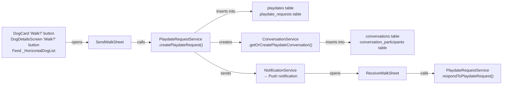
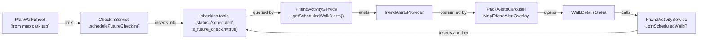

# Walk Together Feature — Architecture & Sprint Plan

## Current Architecture Map

The Walk Together feature is split across **two independent backend systems** that don't talk to each other. This is the core architectural issue.

### System A: Direct Walk Invites (Playdate-based)

**DB Tables**: `playdates`, `playdate_requests`, `playdate_participants`, `conversations`, `conversation_participants`, `messages`

### System B: Public Scheduled Walks (CheckIn-based)

**DB Table**: `checkins`

### The Problems

These two systems are **disconnected**. A walk sent via `SendWalkSheet` (System A) **never appears** in the Pack Alerts carousel (System B). A walk scheduled via `PlanWalkSheet` (System B) **never creates a group chat** (System A).

---

## Complete File Map

### Layer 1: Models
| File | Role |
|------|------|
| [friend_alert.dart](file:///Users/Chen/Desktop/projects/barkdate%20(1)/lib/models/friend_alert.dart) | `FriendAlert` model + `FriendAlertType` enum. Factory for `walkTogether` alerts |
| [checkin.dart](file:///Users/Chen/Desktop/projects/barkdate%20(1)/lib/models/checkin.dart) | `CheckIn` model for scheduled/active check-ins |
| [message.dart](file:///Users/Chen/Desktop/projects/barkdate%20(1)/lib/models/message.dart) | `Message` model for chat |

### Layer 2: Services (Backend)
| File | Role |
|------|------|
| [checkin_service.dart](file:///Users/Chen/Desktop/projects/barkdate%20(1)/lib/services/checkin_service.dart) | `scheduleFutureCheckIn`, `cancelScheduledCheckIn` — writes to `checkins` table |
| [friend_activity_service.dart](file:///Users/Chen/Desktop/projects/barkdate%20(1)/lib/services/friend_activity_service.dart) | Aggregates 7 alert types including `_getScheduledWalkAlerts` and `_getUserOwnUpcomingWalkAlerts`. Returns `FriendAlert` list |
| [bark_playdate_services.dart](file:///Users/Chen/Desktop/projects/barkdate%20(1)/lib/supabase/bark_playdate_services.dart) | `PlaydateRequestService.createPlaydateRequest`, `.respondToPlaydateRequest` — writes to `playdates` + `playdate_requests` tables |
| [conversation_service.dart](file:///Users/Chen/Desktop/projects/barkdate%20(1)/lib/services/conversation_service.dart) | `getOrCreatePlaydateConversation`, `ensurePlaydateParticipant` — manages group chat for playdates |
| [dog_friendship_service.dart](file:///Users/Chen/Desktop/projects/barkdate%20(1)/lib/services/dog_friendship_service.dart) | Friend list queries used by `FriendActivityService.getAlerts` |

### Layer 3: Providers (Riverpod)
| File | Role |
|------|------|
| [friend_activity_provider.dart](file:///Users/Chen/Desktop/projects/barkdate%20(1)/lib/features/feed/presentation/providers/friend_activity_provider.dart) | `friendAlertsProvider` (30s auto-refresh), `scheduledWalksForMapProvider` |

### Layer 4: UI Sheets
| File | Role |
|------|------|
| [send_walk_sheet.dart](file:///Users/Chen/Desktop/projects/barkdate%20(1)/lib/widgets/send_walk_sheet.dart) | Walk invitation bottom sheet. Calls PlaydateRequestService. **Does NOT create a group chat or redirect to it.** |
| [receive_walk_sheet.dart](file:///Users/Chen/Desktop/projects/barkdate%20(1)/lib/widgets/receive_walk_sheet.dart) | Walk response bottom sheet. Accept/Decline/Counter |
| [plan_walk_sheet.dart](file:///Users/Chen/Desktop/projects/barkdate%20(1)/lib/widgets/plan_walk_sheet.dart) | Schedule a walk at a park (CheckIn-based). No group chat |
| [walk_details_sheet.dart](file:///Users/Chen/Desktop/projects/barkdate%20(1)/lib/widgets/walk_details_sheet.dart) | View walk details, join/cancel. Used for CheckIn-based walks |
| [pack_alerts_carousel.dart](file:///Users/Chen/Desktop/projects/barkdate%20(1)/lib/widgets/pack_alerts_carousel.dart) | Horizontal carousel on feed. Routes `walkTogether` to WalkDetailsSheet |
| [pack_alert_card.dart](file:///Users/Chen/Desktop/projects/barkdate%20(1)/lib/widgets/pack_alert_card.dart) | Single alert card UI |
| [map_friend_alert_overlay.dart](file:///Users/Chen/Desktop/projects/barkdate%20(1)/lib/widgets/map_friend_alert_overlay.dart) | Floating card overlay on map |
| [playdate_action_popup.dart](file:///Users/Chen/Desktop/projects/barkdate%20(1)/lib/widgets/playdate_action_popup.dart) | Confirmed walk detail popup (Chat, Reschedule, Cancel) |

### Layer 5: Entry Points
| File | Where walks are triggered |
|------|--------------------------|
| [feed_screen.dart](file:///Users/Chen/Desktop/projects/barkdate%20(1)/lib/features/feed/presentation/screens/feed_screen.dart) L1924 | DogCard "Walk?" → opens `SendWalkSheet` |
| [dog_details_screen.dart](file:///Users/Chen/Desktop/projects/barkdate%20(1)/lib/features/profile/presentation/screens/dog_details_screen.dart) L167 | "Walk?" button → opens `SendWalkSheet` |
| [dog_card.dart](file:///Users/Chen/Desktop/projects/barkdate%20(1)/lib/widgets/dog_card.dart) L287 | "Walk?" button text (triggers `onBarkPressed` callback) |
| [chat_detail_screen.dart](file:///Users/Chen/Desktop/projects/barkdate%20(1)/lib/screens/chat_detail_screen.dart) | Chat screen — **NO walk integration currently** |

---

## Identified Bugs & Gaps

| # | Issue | Root Cause | Impact |
|---|-------|-----------|--------|
| 1 | **No group chat created on walk send** | `SendWalkSheet._sendWalkRequest()` calls `PlaydateRequestService.createPlaydateRequest()` which DOES call `ConversationService.getOrCreatePlaydateConversation()` — but after sending, the user is NOT navigated to the chat. They just see a SnackBar. | User has no way to coordinate the walk |
| 2 | **No in-chat walk card** | Chat screen (`chat_detail_screen.dart`) has no concept of a "walk card" or interactive walk widget. It only shows text bubbles. | Users can't see walk details, accept/decline from chat |
| 3 | **Own walks show with `parkId: null`** | `_getUserOwnUpcomingWalkAlerts()` queries `playdates` table but sets `parkId: null`. When the CTA is tapped, it falls through to PlaydatesRoute instead of WalkDetailsSheet. | Own scheduled walks are unusable in the carousel |
| 4 | **No "Plan Walk" entry point on map** | `PlanWalkSheet` exists but is never wired to the map bottom sheet. No button triggers it. | System B walks can't be created |
| 5 | **Walk accept doesn't update carousel** | `ReceiveWalkSheet` calls `PlaydateRequestService.respondToPlaydateRequest()` which updates `playdates` table, but doesn't `ref.invalidate(friendAlertsProvider)` — the carousel doesn't refresh. | Stale data in UI |
| 6 | **Chat uses `match_id` not `conversation_id`** | `ChatDetailScreen` streams on `messages.match_id` but the walk system uses `conversations` table. These are separate messaging systems. | Walk group chats may not load messages properly |
| 7 | **Walk cards in carousel lack participant photos** | `PackAlertCard` only shows emoji + headline text. No participant avatars or "2 joining" visual. | Cards look plain, low engagement |
| 8 | **No way to cancel a sent walk from sender side** | `SendWalkSheet` sends the request and pops. No pending walk management screen. | Sender is stuck if plans change |
| 9 | **`DogCard` button says "Walk?" but fires `onBarkPressed`** | The `DogCard._buildFriendButtons` uses the bark callback for the Walk button, and shows "Walk Requested!" after tap. This is confusing. | UX confusion between bark and walk |
| 10 | **Notification tap → ReceiveWalkSheet** needs exact payload keys | Missing keys silently fail. No error messaging. | Broken flow from push notifications |
| 11 | **Map scheduled walk markers not wired** | `scheduledWalksForMapProvider` exists and `FriendActivityService.getScheduledWalksForMap()` works, but the map screen doesn't render these as markers. | Scheduled walks invisible on map |
| 12 | **PlanWalkSheet creates a checkin but no notification to friends** | Only a SnackBar is shown. Friends discover it via polling (30s timer), not a push. | Friends may miss the walk entirely |

---

## Sprint Plan

### Sprint 0: Rename `onBarkPressed` → `onWalkPressed` *(cleanup)*

**Goal**: Clean up the confusing callback name across the codebase. Quick, safe rename.

#### Files to Change:

| File | Lines | What to rename |
|------|-------|----------------|
| [dog_card.dart](file:///Users/Chen/Desktop/projects/barkdate%20(1)/lib/widgets/dog_card.dart) | L10, L22, L80, L395, L607 | Field declaration `onBarkPressed` → `onWalkPressed`, all internal references |
| [feed_screen.dart (old)](file:///Users/Chen/Desktop/projects/barkdate%20(1)/lib/screens/feed_screen.dart) | L1163, L1181 | Callback name + method name `_onBarkPressed` → `_onWalkPressed` |
| [feed_screen.dart (features)](file:///Users/Chen/Desktop/projects/barkdate%20(1)/lib/features/feed/presentation/screens/feed_screen.dart) | L1691, L1780, L1919 | Named parameter `onBarkPressed:` → `onWalkPressed:` |

---

### Sprint 1: Walk Send → Group Chat Flow *(core fix)*

**Goal**: When a user sends a walk invite, immediately create+open a group chat with a walk card in it.

#### Changes:

##### [MODIFY] [send_walk_sheet.dart](file:///Users/Chen/Desktop/projects/barkdate%20(1)/lib/widgets/send_walk_sheet.dart)
- After `PlaydateRequestService.createPlaydateRequest()` succeeds, fetch the created conversation via `ConversationService.getPlaydateConversation(playdateId)`
- Navigate to the chat screen with the `conversationId` instead of just popping + SnackBar
- Pass walk metadata to the chat so the walk card can render

##### [NEW] `lib/widgets/chat_walk_card.dart`
- A rich, interactive card widget shown **inside chat bubbles** for walk invites
- Shows: park name, date/time, map thumbnail, participant avatars, status badge
- Tap actions: "View Details" → opens WalkDetailsSheet, "Accept" / "Decline" inline

##### [MODIFY] [chat_detail_screen.dart](file:///Users/Chen/Desktop/projects/barkdate%20(1)/lib/screens/chat_detail_screen.dart)
- Add awareness of the conversation's `playdate_id`
- If conversation has a linked playdate, render a `ChatWalkCard` as a pinned header or first message
- Support opening WalkDetailsSheet from the card
- Fix messaging to use `conversation_id` instead of `match_id` (or add support for both)

---

### Sprint 2: Walk Details Sheet Fixes *(data integrity)*

**Goal**: Make WalkDetailsSheet work correctly for both CheckIn-based and Playdate-based walks.

##### [MODIFY] [walk_details_sheet.dart](file:///Users/Chen/Desktop/projects/barkdate%20(1)/lib/widgets/walk_details_sheet.dart)
- Support loading walk details from EITHER the `playdates` table or the `checkins` table based on what data is passed
- Show real participant data (photos, names) from `playdate_participants` or `checkins` queries
- Fix "Join the Walk" to work for both systems
- Fix "Cancel My Walk" to work for both systems
- Add "Open Chat" button when a connected conversation exists

##### [MODIFY] [friend_activity_service.dart](file:///Users/Chen/Desktop/projects/barkdate%20(1)/lib/services/friend_activity_service.dart)
- Fix `_getUserOwnUpcomingWalkAlerts()` to pass `parkId` from the `playdates.location` field instead of `null`
- Add `playdateId` to walk alert metadata so the WalkDetailsSheet can query playdate participants

---

### Sprint 3: Feed Carousel & Entry Points *(visibility)*

**Goal**: Walk cards show correctly in the carousel and the Plan Walk entry point works on the map.

##### [MODIFY] [pack_alerts_carousel.dart](file:///Users/Chen/Desktop/projects/barkdate%20(1)/lib/widgets/pack_alerts_carousel.dart)
- Fix `_handleCtaTap` to handle own playdate-based walks (when `parkId` is null but `playdateId` exists) — open WalkDetailsSheet with playdateId

##### [MODIFY] [friend_activity_service.dart](file:///Users/Chen/Desktop/projects/barkdate%20(1)/lib/services/friend_activity_service.dart)
- Remove `_getScheduledWalkAlerts()` (was querying `checkins` table)
- Update `_getUserOwnUpcomingWalkAlerts()` to pass proper `parkId` and `playdateId`
- Add new `_getFriendUpcomingWalkAlerts()` that queries `playdates` table for friends' walks
- All walk alerts now come from one source: `playdates` table

##### [MODIFY] Map bottom sheet (in `map_tab_screen.dart` or `map_bottom_sheets.dart`)
- Add "Plan a Walk" button to the park detail bottom sheet
- Wire it to open `PlanWalkSheet` with the park's ID and name

##### [MODIFY] [plan_walk_sheet.dart](file:///Users/Chen/Desktop/projects/barkdate%20(1)/lib/widgets/plan_walk_sheet.dart)
- **Switch from `CheckInService.scheduleFutureCheckIn()` to `PlaydateRequestService`** (core Decision 1 change)
- Create a playdate entry + group conversation
- Send notifications to all friends via `NotificationService`
- Invalidate `friendAlertsProvider` so the carousel updates

---

### Sprint 4: Chat ↔ Walk Live Sync *(cross-feature integration)*

**Goal**: Actions taken on a walk (accept, decline, join, cancel) update both the chat card and the carousel in real-time.

##### [MODIFY] [receive_walk_sheet.dart](file:///Users/Chen/Desktop/projects/barkdate%20(1)/lib/widgets/receive_walk_sheet.dart)
- After accepting/declining, invalidate `friendAlertsProvider`
- Post a system message to the walk's group chat (e.g., "Luna's human accepted the walk! 🎉")
- Navigate to the chat after accepting

##### [MODIFY] [conversation_service.dart](file:///Users/Chen/Desktop/projects/barkdate%20(1)/lib/services/conversation_service.dart)
- Add helper `getConversationForPlaydate()` that returns conversation metadata suitable for navigation

##### [MODIFY] [dog_card.dart](file:///Users/Chen/Desktop/projects/barkdate%20(1)/lib/widgets/dog_card.dart)
- Already renamed in Sprint 0. Ensure walk accept/decline routes correctly

---

### Sprint 5: Map & Notifications Polish *(discoverability)*

**Goal**: Walks are visible on the map as markers and notifications route correctly.

##### [MODIFY] [map_tab_screen.dart](file:///Users/Chen/Desktop/projects/barkdate%20(1)/lib/screens/map_v2/map_tab_screen.dart)
- Consume `scheduledWalksForMapProvider`
- Render custom markers for scheduled walks (clock icon, participant count badge)
- Tap marker → open WalkDetailsSheet

##### [MODIFY] Notification routing (wherever push notification payloads are handled)
- Ensure `playdate_invited` notification type opens `ReceiveWalkSheet` with complete metadata
- Ensure `playdate_accepted` notification type opens chat

---

## Decisions (Locked In ✅)

> [!IMPORTANT]
> **Decision 1: Keep both tables, each doing their proper job.**
> - **`playdates` table** (Notebook A) = ALL walk planning (invites, scheduling, group chats). **SendWalkSheet already uses this and stays exactly as-is — no changes needed.**
> - **`checkins` table** (Notebook B) = "I'm at this park RIGHT NOW" only. No more scheduling future walks in it.
> - **Only `PlanWalkSheet` needs rewiring** — it currently writes to the wrong notebook (checkins), so we switch it to use `PlaydateRequestService` instead.
>
> ✅ **"Send to Hedva" button color changed from orange to green** (`0xFF4CAF50`)

> [!IMPORTANT]
> **Decision 2: In-chat walk card = Both styles.** A small pinned status bar at the top of chat (always visible: park, time, status) PLUS a rich detailed card as the first system message in the chat stream (with map preview, participants, action buttons).

> [!IMPORTANT]
> **Decision 3: Rename `onBarkPressed` → `onWalkPressed` everywhere.** Full consistency. 4 files, 10 occurrences.

## Verification Plan

### Automated Tests
- Run existing unit tests: `flutter test test/utils/validators_test.dart`
- Run `flutter analyze` after each sprint to catch type errors

### Manual Verification (Per Sprint)
1. **Sprint 1**: Send a walk → verify group chat opens → verify walk card shows in chat
2. **Sprint 2**: Open WalkDetailsSheet from carousel → verify join/cancel works → verify participant list
3. **Sprint 3**: Open map → tap a park → verify "Plan a Walk" button → schedule → verify carousel updates
4. **Sprint 4**: Accept a walk → verify chat updates → verify carousel updates → verify WalkDetailsSheet updates
5. **Sprint 5**: Check map for scheduled walk markers → tap → verify WalkDetailsSheet opens
