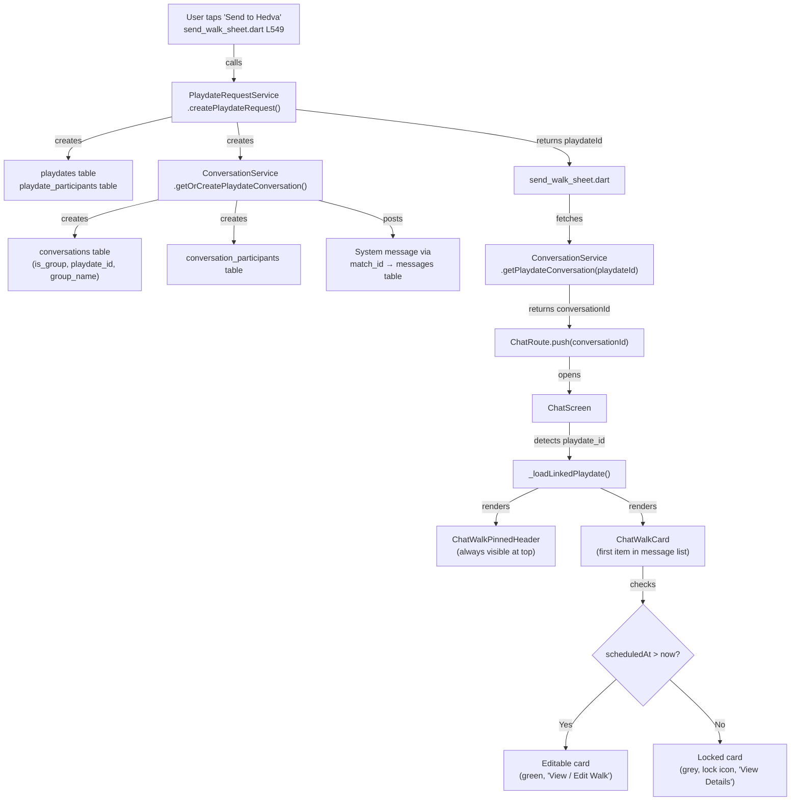

# Sprint 0 + Sprint 1 Verification Report

## 1. Static Analysis ✅

```
flutter analyze → No issues found!
```

## 2. iOS Build ✅

```
flutter build ios --no-codesign --debug → ✓ Built build/ios/iphoneos/Runner.app
```

## 3. Database Schema Verification (via curl) ✅

| Table | Columns Tested | Result |
|-------|---------------|--------|
| `conversations` | `id, playdate_id, is_group, group_name` | ✅ All exist |
| `playdates` | `id, title, location, scheduled_at, status, organizer_id, latitude, longitude` | ✅ All exist |
| `playdate_participants` | `id, playdate_id, user_id, dog_id` | ✅ All exist |
| `messages` | `id, match_id, sender_id, receiver_id, content, message_type, is_read` | ✅ All exist |
| `conversation_participants` | `id, conversation_id, user_id, role` | ⚠️ Recursive RLS policy detected |

## 4. Critical Bug Found & Fixed 🐛

> [!WARNING]
> **Bug**: `ConversationService.postSystemMessage()` was inserting `conversation_id` into the `messages` table, but that column **doesn't exist**. The table uses `match_id` instead.
>
> Also: `sender_id: null` would fail because the column requires a non-null value.

**Fix applied**: `postSystemMessage()` now:
- Uses `match_id` instead of `conversation_id`
- Uses `message_type: 'system'` instead of `is_system_message: true`
- Fetches a participant to use as sender/receiver placeholder

## 5. Code Flow Trace ✅

### Sprint 0: Rename `onBarkPressed` → `onWalkPressed`

```
grep onBarkPressed → 0 results (fully cleaned)
grep onWalkPressed → 10 results across 3 files (all consistent)
```

### Sprint 1: Walk Send → Chat Flow



## 6. Additional Fix: System Messages

- Added `MessageType.system` to `message.dart` enum
- `ChatScreen` now parses `message_type` from Supabase data
- System messages render as centered, grey info cards (not chat bubbles)

## 7. Known Issues (Pre-existing, not from our changes)

| Issue | Severity | Notes |
|-------|----------|-------|
| `conversation_participants` has recursive RLS policy | ⚠️ Medium | May cause errors when querying participants. Pre-existing Supabase config issue. |
| Some messages might use `match_id` from the old match system, not from conversations | ℹ️ Low | The `match_id` field serves dual purpose (old matches + new conversations). Works because both use UUID format. |
